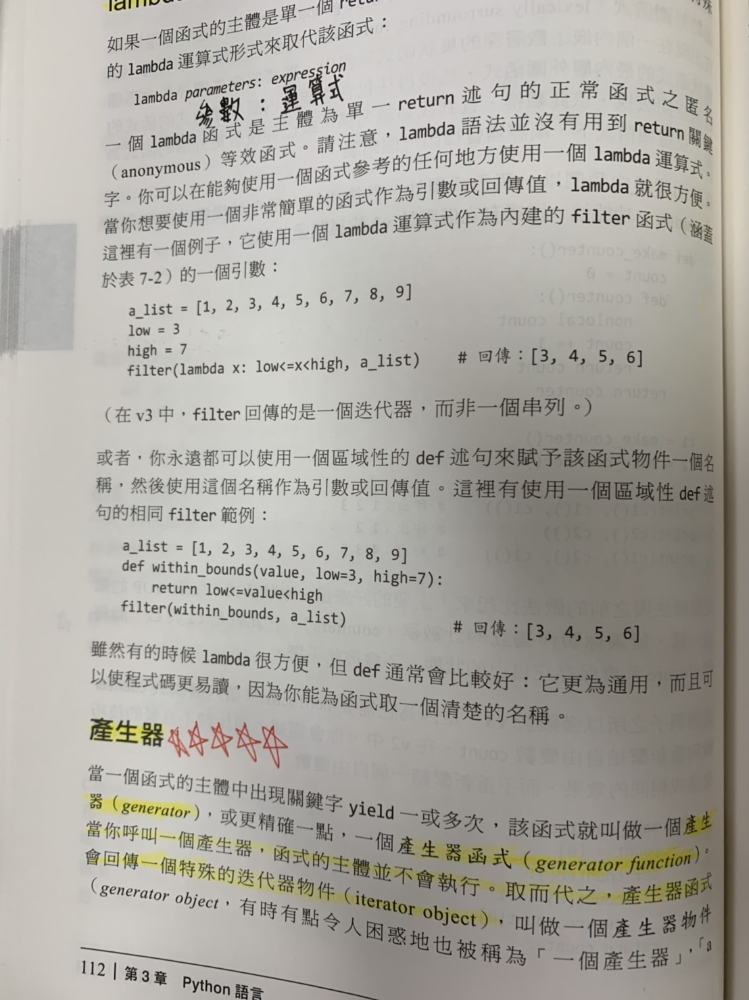
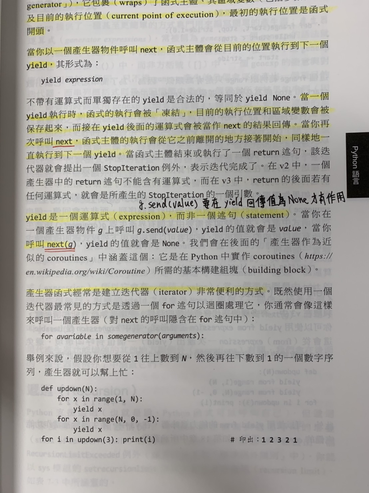
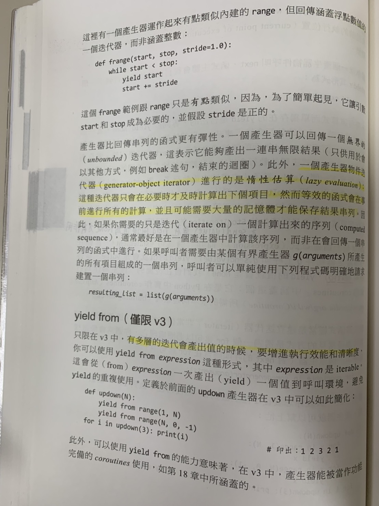
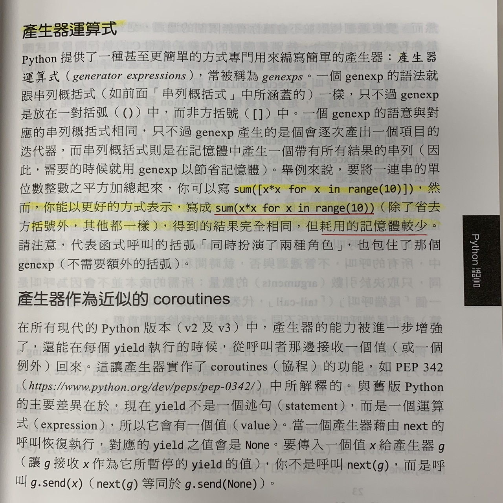

# Python技術手冊筆記

## Chapter 3

### 資料型別

* Pyhon中的物件可分為可變物件\(mutable object\)及不可變物件\(immutable object\)

### 數字

* 二進位表示法，以0b開頭，後續接二進位值

```text
b1 = 0b01 #1
b2 = 0b110010 #50
```

* 八進位表示法以，0o開頭，後續接八進位值

```text
o1 = 0o1 #1
o2 = 0o27 #23
```

* 十六進位表示法，0x開頭，後續接十六進位值

```text
x1 = 0x1 #1
x2 = 0x2CA #714
```

### 元組 tuple

* tuple是由項目\(items\)所組成的不可變的有序序列，每個項目可以是不同型別。
* 可以使用可變序列當作tuple的項目，但實務上最好不要這麼做。

```text
#tuple宣告
t1 = (1,2,3)
t2 = tuple([1,2,3]) #tuple()宣告,參數必須為可迭代的(iterable),或單一值
t3 = tuple() #空tuple,也可單獨使用()
print(t1) #(1,2,3)
print(t2) #(1,2,3)
print(t3) #()
```

### 串列 list 

* list是由項目\(items\)所組成的不可變的有序序列

```text
#list宣告
l1 = [1,2,3]
l2 = list('wow') #list()宣告,參數必須為可迭代的(iterable),或單一值
l3 = list() #空list, 也可單獨使用[]
print(l1) #[1,2,3]
print(l2) #['w', 'o', 'w']
print(l3) #[]
```

### 集合 set

* 集合有set和frozenset\(凍結集\)，frozenset是不可變的
* set是任意順序的唯一項目群集。項目可以是不同型別，但它們必須是可雜湊的。set的項目不可是set，但可以是frozenset

```text
#set宣告
s1 = {1,2,2,3}
s2 = set('wow') #set()宣告,參數必須為可迭代的(iterable),或單一值
s3 = set() #空set, 不可使用{},{}是空字典
print(s1) #{1,2,3}
print(s2) #{'w', 'o'}
print(s3) #set()
```

### 字典 dict

```text
#dict宣告
d1 = {'a':1, 'b':2, 'c':3, 'a':4}
d2 = dict(a=1,b=2,c=3)
d3 = dict([('a',1),('b',2),('c',3)])
d4 = dict() #空字典, 也可單獨使用{}
print(d1) #{'a': 4, 'b': 2, 'c': 3}
print(d2) #{'a': 1, 'b': 2, 'c': 3}
print(d3) #{'a': 1, 'b': 2, 'c': 3}
print(d4) #{}
```

### Boolean值

* 任何非零或非空容器\(string、tuple、list、set、dict\)為true。0\(任何數值型別的\)、None以及空容器為false

### 指定述句

```text
a = 2
b = 3
a = b = c = 0

x = (1,2)
a, b = x

x = [1,2,3,4,5]
first, *middle, last = x
#上述句等同
first, middle, last = x[0], x[1:-1], x[-1]
```

### 比較鍊串 Comparison Chaining

* Python允許比較運算是串連起來，其中以含and的意思

```text
a < b <= c < d
#等同 a<b and b<=c and c<d
#a!=b!=c 不代表a!=c
```

### 短路運算子

* and : 右邊的運算元只會在左邊的運算元皆為ture時才會被估算
* or : 右邊的運算元只會在左邊的運算元皆為false時才會被估算

```text
x, y, z=5, 0, 2
_and = x and y and z #估算至y就停止,並回傳y
print(_and) #0
_or = x or y or z #估算至x就停止,並回傳x
print(_or) #5
```

### 三元運算子

* whentrue if condition else whenfalse

```text
x = 12
y = 20
result = x if (x>y) else y #result=y
print(result) #20
```

### 序列切片

* S是一個串列的話，可以用S\[i : j : k\]表式一個子序列
  * i = 起始位置\(包含\)，等於0可省略
  * j = 結束位置\(不包含\)， j大於或等於序列長度可省略
  * k = 步伐，預設為1
  * i, j, k必為整數
  * k &gt; 1 時，i 必須小於 j。 k &lt; 0時， i 必須大於 j。否則回傳空序列

```text
ls = [0,1,2,3,4,5,6] #list
tp = (0,1,2,3,4,5,6) #tuple
print(ls[:]) #[0, 1, 2, 3, 4, 5, 6]
print(ls[1:4]) #[1, 2, 3]
print(ls[-3:]) #[4, 5, 6]
print(tp[1:5:2]) #(1, 3)
print(tp[5:2:-2]) #(5, 3)
print(tp[5:2:2]) #()
```

### in-place運算

```text
l1, L2 = [12,3], [1,2]
l1+=l2 #效果等同l1.extend(l2)
print(l1) #[12,3,1,2]

L = [5,4]
L *= 3 #把n-1個L加到L尾端
print(L) #[5,4,5,4,5,4]
L *= 0
print(L) #[]
```

### 破壞性迭代 destructive iteration

* 在破懷性迴圈主體內，可以修改S\(修改、移除項目\)，而非破壞性是不允許的
* 在大型集合的迴圈處理，可以節省記憶體\(如果項目用完就不需要了的話\)

```text
#破壞性迴圈
while S:
	itme = S.pop()
	# do something..

#非破壞性迴圈
for item in S:
	# do something..
```

### 串列概括式 list comprehension

* 語法: \[expression for target in iterable clauses\]
  * clauses為一個或多個字句

```text
result = [i*5 for i in range(5)]
print(result) #[0, 5, 10, 15, 20]

result = [i*5 for i in range(5) if i>2]
print(result) #[15, 20]
```

### 集合概括式

* 同串列概括式
* '\[ \]' 改為 '{ }'

```text
result = {i*5 for i in range(5)}
print(result) #{0, 5, 10, 15, 20}
```

### 字典概括式

* 同串列概括式
* expression必須包含key:value。
* '\[ \]' 改為 '{ }'

```text
result = {i:i//2 for i in range(5)}
print(result) #{0: 0, 1: 0, 2: 1, 3: 1, 4: 2}
```

### 參數

* \*args: 將任何額外參數收集到一個tuple中，並對應到args變數名稱
  * 在其之"前"的參數"不能"以指定名稱方式傳入
  * 在其之"後"的參數"必須"以指定名稱方式傳入
* \*\*kwds: 將任何額外具名參數收集到一個dict中，並對應到kwds變數名稱
  * 在其之後不可有任何參數

```text
#*args test
def args(a,*middle,b): 
	print(a)
	print(middle)
	print(b)
args(1,2,3,4,b=5) #b必須指定
#1
#(2,3,4)
#5
```

```text
#**kwds test
def kwds(a,**kwds): 
	print(a)
	print(kwds)
kwds(1,b=2,c=3)
#1
#{'b': 2, 'c': 3}
```

* 僅限關鍵字\(keyword-only parameters\)
  * 僅限python3版本
  * 使參數必須以指定名稱方式傳入
  * 必須出現在\*args之後，\*\*kwds之前

```text
def f(a, *, b, c=56): #b為僅限關鍵字
    return a, b, c
f(12, b=34) #(12, 34, 56)
f(12) #TypeError
#missing 1 required keyword-only argument: 'b'

def g(x, *a, b=23, **k): #b為僅限關鍵字
    return x, a, b, k
g(1,2,3,c=99) #(1, (2,3), 23, {'c': 99})
```

### 參數傳遞

* \*args: 將序列項目逐一傳入
* \*\*kwds: 將字典,以指定名稱方式逐一傳入
* \*kwds: 將字典的key逐一傳入
* \*kwds.values\(\):將字典的value逐一傳入

```text
tp = [1,2,3,]
d = {'x':1, 'y':1, 'z':1}
sum_args(*tp)
#等同於sum_args(tp[0],tp[1],tp[2])
showkey(**d)
#等同於sum_args(x=d['x'], y=d['y'], z=d['z'])
```

### Docstrings

用來描述函式\(類別、模組\)

當在函式\(類別、模組\)中第一個述句為字串時，該字串為docstring屬性

* 第一行: 簡要說明函式\(類別、模組\)用途
* 第二行: 空白行
* 其餘行: 描述函式\(類別、模組\)參數、先決條件、回傳值以及副作用，以空白行隔開

### 函式注釋與型別提示

* 在參數後面加入 :type 添加型別提示
* 再函式參數與 : 之間加入-&gt;type添加函式回傳值提示
* 函式物件的\_\_annotations\_\_屬性會將每個提示以dict方式儲存

```text
def returnStr(string:str) -> str:
	return string

print(returnStr('Hi')
print(returnStr(12)) #不強制使用行別提示的型別
print(returnStr.__annotations__)
#{'string': <class 'str'>, 'return': <class 'str'>}
```

### 巢狀函式

```text
def percent1(a, b, c):
	def pc(target, total=a+b+c):
		return (target*100.0)/ total
	print(pc(a), pc(b), pc(c))

def percent2(a, b, c):
	def pc(target):
		return (target*100.0)/ (a+b+c)
	print(pc(a), pc(b), pc(c))
#percent1 與 percent2 的差別在於percent只會計算一次a+b+c
#但還是要依情況使用
```

### 閉包\(closure\)

* 當希望某些參數在建構時就固定下來時，除了物件導向，也可以使用closure的方式，將資料與方法包在一起。

```text
def make_adder(augend):
	def add(addend):
		return addend+augend
	return add

adder = make_adder(7)
print(adder(3)) #10
```

### 用closure做一個計數器

```text
def make_counter():
	count = 0
	def counter():
		nonlocal count #nonlocal類似global, 但範圍只到所有外層函式
		count+=1
		return count
	return counter

c1 = make_counter() #各自獨立的counter
c2 = make_counter() #各自獨立的counter
print(c1(), c1(), c1())
print(c2())
print(c1(),c2())
```

### lambda

* lambda函式是主體為單一return述句的匿名函式
* 語法: lambda target: return value

```text
ls = [1,2,3,4,5]
low = 2
result = [r for r in filter(lambda x: low<x, ls)]
print(result)
```

* 等同於

```text
ls = [1,2,3,4,5]
low = 2
def bound(x, low=low):
	return low<x
result = [x for x in filter(bound, ls)]
print(result)
```

### 產生器 generator

* 當一個函式主體裡面出現關鍵字yield一次或多次，那函式就是一個產生器
* 太多了不想打，直接看圖









## Chapter 3 Python物件導向

### 定義類別

```text
class classname(base-class1,base-class2,...):
    statement..
```

* classname: 類別名稱
* base-class: 父類別,可以零到多個
* base-class可以是一個具名參數metaclass=..., 代別元類別
* 每個class都是object的子類別，class C1\(\) = class C1\(object\)

### 類別隱含屬性

* \_\_name\_\_: class名稱
* \_\_bases\_\_: class所有父類別的名稱\(tuple\)
* \_\_dict\_\_私有屬性是用來儲存

```text
class C1():
	x = 10
	def get_x(self):
		return x

class C2(C1):
	x = 20

print(C2.__name__)
print(C2.__bases__)
print(C2.__dict__)
```

### 私有變數

* 在變數名稱前加上兩個底線\_\_value就是私有變數，避免子類別的屬性命名衝突，或是直接存取屬性

### 描述器

```text
class Integer(object):
	"""
	descriptor描述器
	如果類別裡面包含了 __set__、__get__、__delete__其中一(多)種methods，那就是一个描述器
	通常用於對類別的操作進行hook(掛勾)
	描述器不會單獨存在，通常會附加於其他類別之中
	"""
	def __init__(self, name):
		self.name = name

	def __set__(self, instance, value):#修改屬性時，先進行一些操作
		if not isinstance(value, int):
			raise TypeError('Expected an int')
		instance.__dict__[self.name] = value
 
class Point(object):
	x = Integer('x')
	y = Integer('y')
	def __init__(self, x, y):
		self.x = x
		self.y = y

p = Point(2, 3)
p.x = 9
p.y = 9.9#這句會拋出TypeError: Expected an int錯誤.這就是描述器的作用
# p.x = 9 等同於p.__dict__['x'] = 9
```


